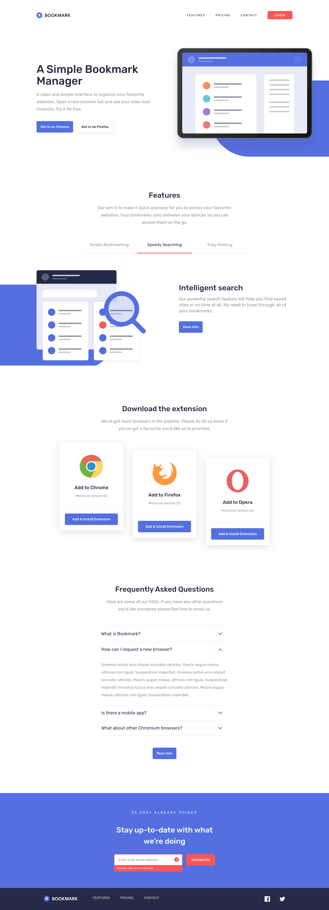

# Frontend Mentor - Bookmark landing page
[](https://github.com/adryanrosa/bookmark-landing-page/blob/main/README.md)

This is a solution to the [Bookmark landing page](https://www.frontendmentor.io/challenges/bookmark-landing-page-5d0b588a9edda32581d29158) challenge on [Frontend Mentor](https://www.frontendmentor.io).


## Table of contents

- [Overview](#overview)
  - [Live site and instructions](#live-site-and-instructions)
  - [The challenge](#the-challenge)
  - [Screenshot](#screenshot)
- [My process](#my-process)
  - [Built with](#built-with)
  - [Useful resources](#useful-resources)
  <!-- - [O que aprendi](#o-que-aprendi)
  - [Desenvolvimento contínuo](#desenvolvimento-contínuo) -->
<!-- - [Autor](#autor) -->

## Overview

### Live site and instructions

- Please visit my application [at](https://url-shortening-api-landing-page-adryanrosa.vercel.app/)
- Want to check it locally? Follow the steps
  1. Clone the repository
    * `git clone git@github.com:adryanrosa/url-shortening-api-landing-page.git`.
    * Enter the cloned repository folder:
     * `cd url-shortening-api-landing-page`

  2. Install the dependencies and start the project
    * Install the dependencies:
     * `npm install`
    * Start the project:
     * `npm run dev` (a new tab should open in your default browser)

### The challenge

Users should be able to:

- View the optimal layout for the site depending on their device's screen size
- See hover states for all interactive elements on the page
- Receive an error message when the newsletter form is submitted if:
  - The input field is empty
  - The email address is not formatted correctly

### Screenshot



## My process

### Built with

- [React](https://reactjs.org/) - Frontend JavaScript library
- [Sass](https://sass-lang.com/) - CSS preprocessor
- [CSS Modules](https://github.com/css-modules/css-modules) - CSS module bundler
- Mobile-first Workflow 

### Useful resources

- [Modular SCSS and Why You Need It](https://medium.com/clover-platform-blog/modular-scss-and-why-you-need-it-6bb2d8c40fd8), [How to Use Sass with CSS Modules in Next.js](https://www.freecodecamp.org/news/how-to-use-sass-with-css-modules-in-next-js/) - Both articles brought to my attention how modular styling can improve the code maintainability experience and make it scalable. For that reason, I wanted to apply what I've learned, based on the architectures shown by the articles

- [Stop using @import with Sass](https://youtu.be/CR-a8upNjJ0), [Sass @import is being replaced](https://youtu.be/dOnYNEXv9BM) - As my first project using Dart Sass, I understood, with these videos, the problems of using @import and the new rules benefits/differences

- [React Accordion Using React Hooks](https://youtu.be/MAD2HnUFjgg) - I had my first contact with the useRef() hook through this video, which was very helpful for building the page accordion

<!-- ### O que aprendi

Use this section to recap over some of your major learnings while working through this project. Writing these out and providing code samples of areas you want to highlight is a great way to reinforce your own knowledge.

To see how you can add code snippets, see below:

```html
<h1>Some HTML code I'm proud of</h1>
```
```css
.proud-of-this-css {
  color: papayawhip;
}
```
```js
const proudOfThisFunc = () => {
  console.log('🎉')
}
```

### Desenvolvimento contínuo

Use this section to outline areas that you want to continue focusing on in future projects. These could be concepts you're still not completely comfortable with or techniques you found useful that you want to refine and perfect. -->

<!-- ## Autor

- Website - [Add your name here](https://www.your-site.com)
- Frontend Mentor - [@yourusername](https://www.frontendmentor.io/profile/yourusername)
- Twitter - [@yourusername](https://www.twitter.com/yourusername) -->
